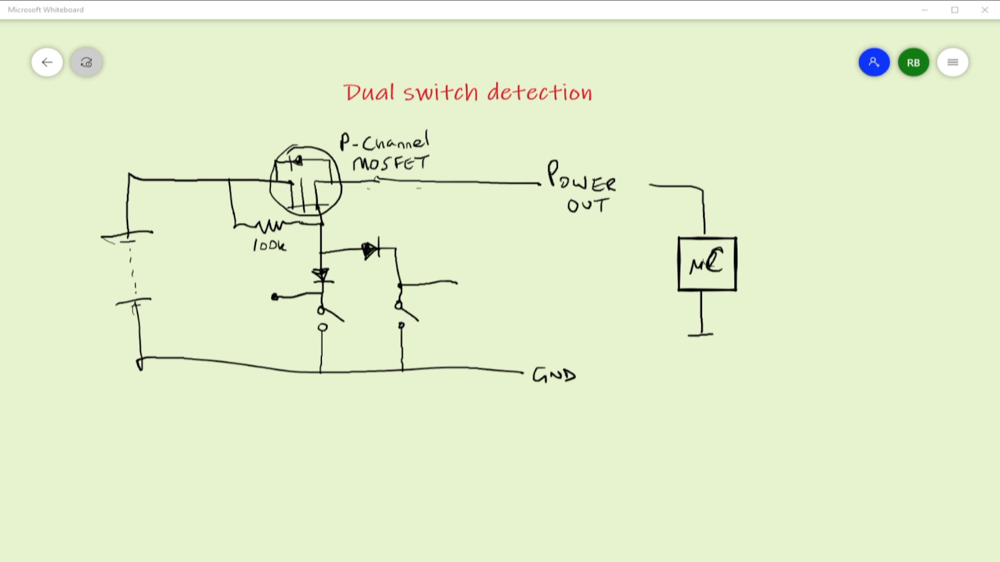

# 218 - Dual Switch Detection with an Arduino
Detecting commoned switches on the Arduino

I'm triggering the Arduino using a dual MOSFET auto on/off configuration with a single switch. 

But I need to add a further switch so how to I enable the Arduino to detect which switch did the triggering?

